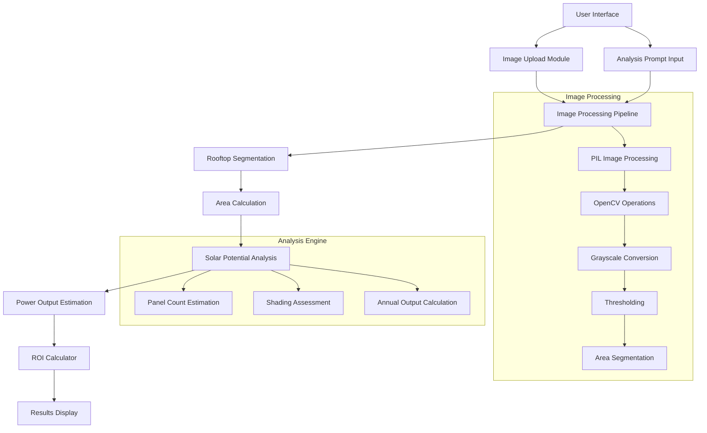
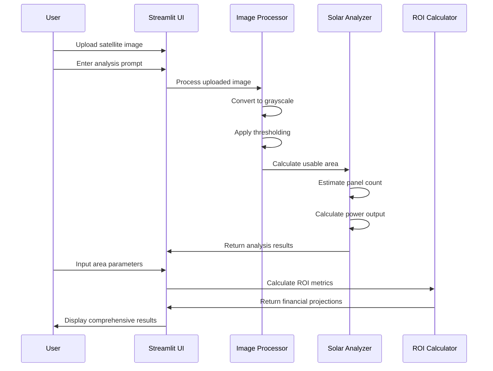

# Solar Industry AI Assistant ☀️

A Streamlit-based web application that analyzes satellite imagery of rooftops to assess solar panel installation potential, providing automated estimates for suitable panel placement, power output, and return on investment calculations.

## 🎯 Project Overview

The Solar Industry AI Assistant leverages computer vision and machine learning techniques to evaluate rooftop suitability for solar panel installations. The application processes satellite imagery to identify optimal placement areas, estimates power generation potential, and calculates financial projections for solar installations.

## 🏗️ System Architecture



## 📋 Features

### Core Functionality
- **Satellite Image Analysis**: Automated processing of rooftop imagery
- **Rooftop Segmentation**: Intelligent identification of suitable installation areas
- **Solar Potential Assessment**: Evaluation of power generation capacity
- **Financial Analysis**: ROI calculations with payback period estimation
- **Interactive Interface**: User-friendly Streamlit web application

### Technical Capabilities
- Multi-format image support (PNG, JPG, JPEG)
- Real-time image processing and analysis
- Customizable analysis prompts
- Dynamic area estimation with adjustable parameters
- Comprehensive financial modeling

## 🚀 Installation & Setup

### Prerequisites
```bash
pip install streamlit pillow numpy opencv-python
```

### Environment Setup
```bash
# Clone the repository
git clone <repository-url>
cd solar-ai-assistant

# Install dependencies
pip install -r requirements.txt

# Run the application
streamlit run solar_ai_app.py
```

### System Requirements
- Python 3.7+
- Minimum 4GB RAM
- OpenCV-compatible system
- Modern web browser

## 📊 Application Workflow



## 🔧 Technical Implementation

### Image Processing Pipeline
```python
def segment_rooftop_area(image: Image.Image) -> float:
    # Grayscale conversion for edge detection
    image_np = np.array(image.convert("L"))
    
    # Binary thresholding for area segmentation
    _, thresh = cv2.threshold(image_np, 180, 255, cv2.THRESH_BINARY)
    
    # Calculate usable area ratio
    area_pixels = np.sum(thresh == 255)
    total_pixels = image_np.shape[0] * image_np.shape[1]
    usable_ratio = area_pixels / total_pixels
    
    return usable_ratio * total_pixels / 10000  # Convert to m²
```

### ROI Calculation Engine
```python
def estimate_roi(area_m2, cost_per_watt=50, efficiency=0.18):
    kw_installed = area_m2 * efficiency
    annual_output_kwh = kw_installed * 1500  # Sun hours factor
    savings_per_year = annual_output_kwh * 6  # ₹6/kWh rate
    cost = kw_installed * 1000 * cost_per_watt / 100
    payback_years = cost / savings_per_year
    
    return annual_output_kwh, savings_per_year, cost, payback_years
```

## 📈 Output Metrics

### Analysis Results
- **Rooftop Area**: Calculated suitable installation area in m²
- **Panel Count**: Estimated number of solar panels that can be installed
- **Power Output**: Annual energy generation in kWh/year
- **Shading Assessment**: Identification of potential shading issues

### Financial Projections
- **Annual Energy Output**: Projected kWh generation per year
- **Cost Savings**: Estimated annual electricity cost reduction
- **Installation Cost**: Total system installation expense
- **Payback Period**: Time required to recover initial investment

## 🎨 User Interface

The application features an intuitive web interface built with Streamlit, providing:

- **File Upload**: Drag-and-drop satellite image upload
- **Analysis Prompt**: Customizable analysis parameters
- **Interactive Results**: Real-time processing and visualization
- **ROI Calculator**: Dynamic financial analysis tools

## 🔍 Use Cases

### Residential Applications
- Homeowner solar potential assessment
- Real estate solar value analysis
- Installation planning and design

### Commercial Applications
- Large-scale solar farm planning
- Industrial rooftop optimization
- Energy audit and consulting services

### Professional Services
- Solar installation company assessments
- Energy consulting and planning
- Government renewable energy programs

## 🤝 Contributing

We welcome contributions to improve the Solar Industry AI Assistant. Please follow these guidelines:

1. Fork the repository
2. Create a feature branch
3. Implement your changes
4. Add comprehensive tests
5. Submit a pull request

## 📄 License

This project is licensed under the MIT License - see the LICENSE file for details.

## 🛠️ Future Enhancements

- Advanced machine learning integration
- Real-time weather data incorporation
- 3D rooftop modeling capabilities
- Integration with solar equipment databases
- Mobile application development

## 📞 Support

For technical support or questions, please contact the development team or create an issue in the project repository.

---

**Built with ❤️ for sustainable energy solutions**
